# svelte-intellisense


[](https://marketplace.visualstudio.com/items?itemName=ardenivanov.svelte-intellisense)


Provides intellisense for data, events, slots etc. in components. Utilizes [sveltedoc-parser](https://github.com/alexprey/sveltedoc-parser) for getting information about components.

## Installation

This extension provides a features for `svelte` language files. For basic support of `svelte` files you should install this extension: [VSCode Svelte](https://marketplace.visualstudio.com/items?itemName=JamesBirtles.svelte-vscode) that provides svelte syntax highlighting and syntax checks.

## Features

### Go to definition

This extension supports a go to definition VSCode feature for quick navigation between components and references.

Just click to component usage in markup or symbol in import section and view its source code.

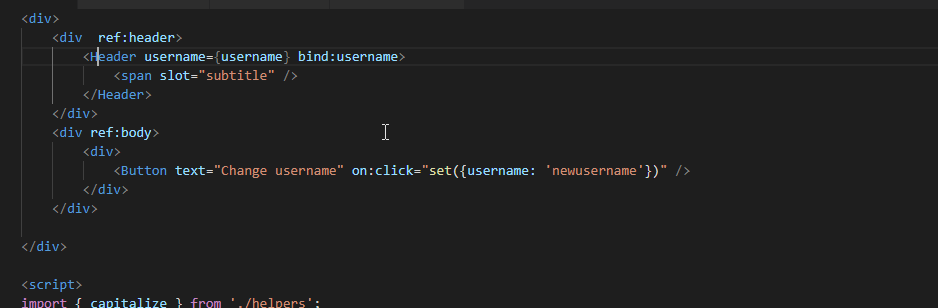

Also that works for component attributes, events, bind, slots:

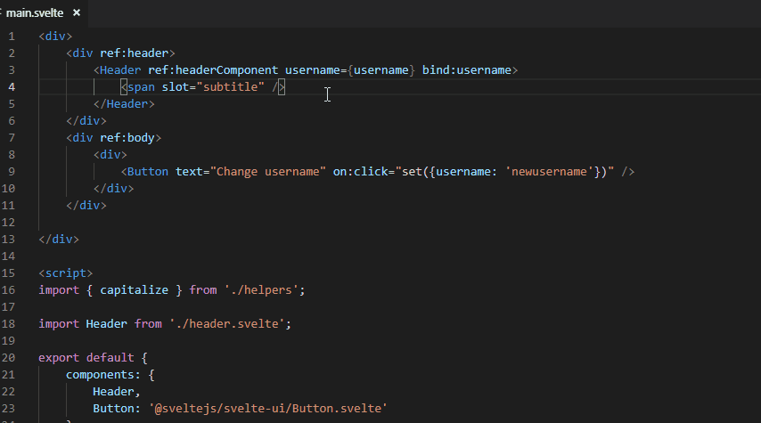
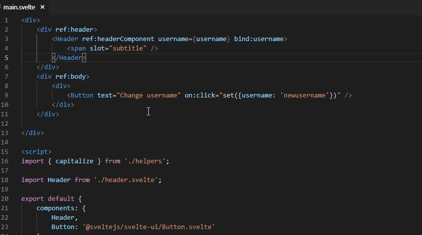

Awesome navigation for methods calling:

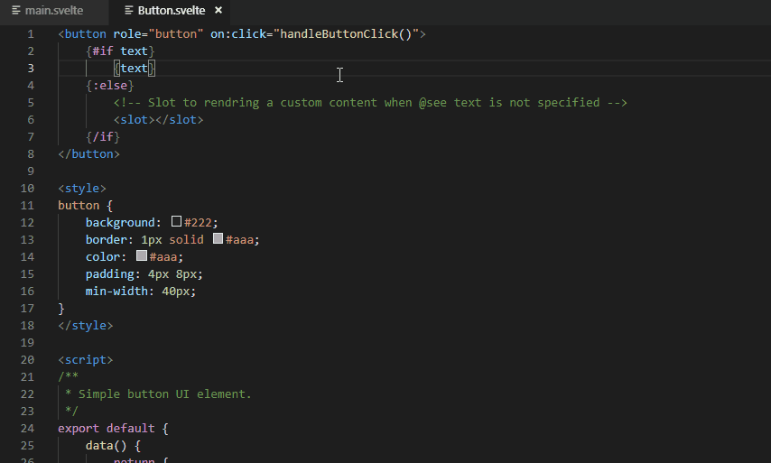

### Hover

Component documentation is provided on hover in template markup, import statement and components section.

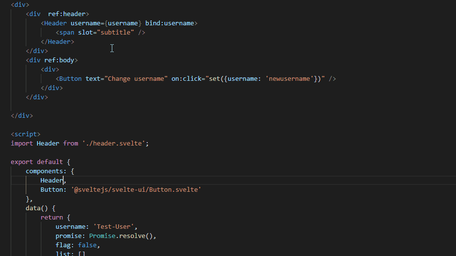

Documentation of component events, props and slots provided as well.

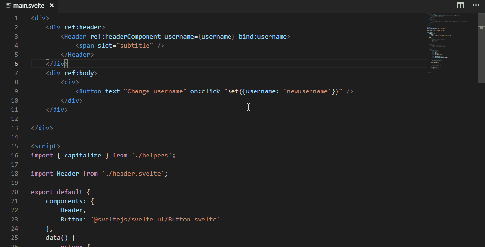

### Completion

1. Path resolving for `import` statement in script path

Allows to quick search for the required files to import, like a script file or a svelte component. Also includes  `node_modules` folder in search results if it exists. Suggestions from `node_modules` are marked with a special label.

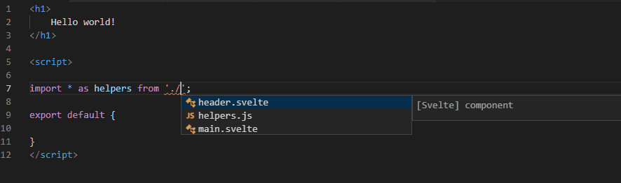

2. Path resolving for `components:` import statement (Svelte 2 only)

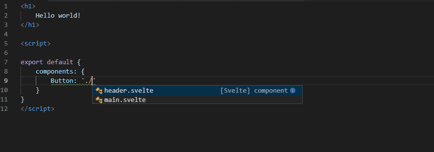

3. Standard svelte syntax completion for HTML tags

- Supports autocompletion for `use:`, `transition:`, `in:`, `out:`, `bind:`, `class:`, `ref:`.


4. Tag-openning completions for svelte special components and imported component

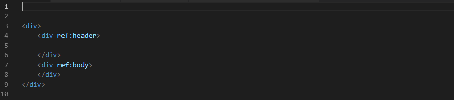

4. Component data and slots

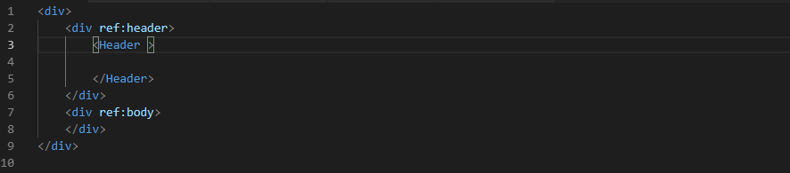

5. Component events and expressions

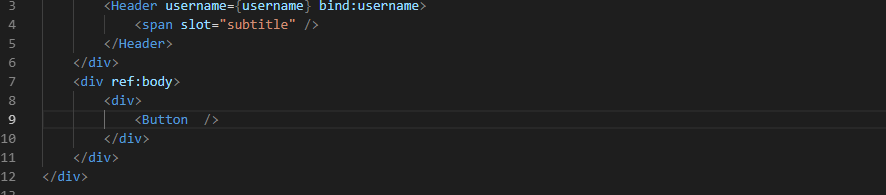

6. Svelte template blocks

This extension supports all svelte blocks - `if`, `each`, `await` - with inner branching.

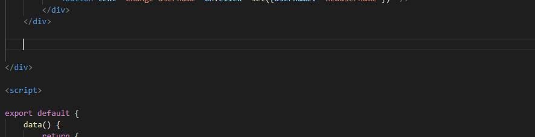

7. Data and computed properties for component state getter (Svelte 2 only)

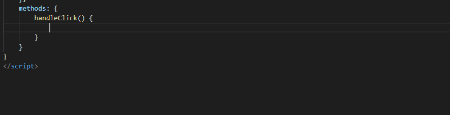

The same is supported for writing a computed property.

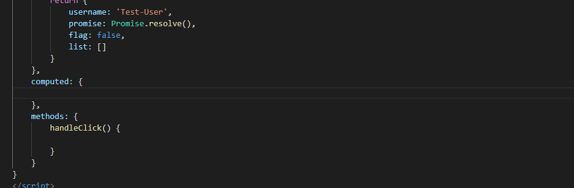

8. Data properties for component state setter (Svelte 2 only)

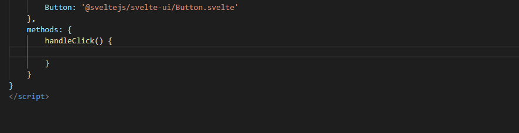

9. Svelte methods in script section (Svelte 2 only)

Also provides auto-completion for `this.refs.` (Svelte 2 only)

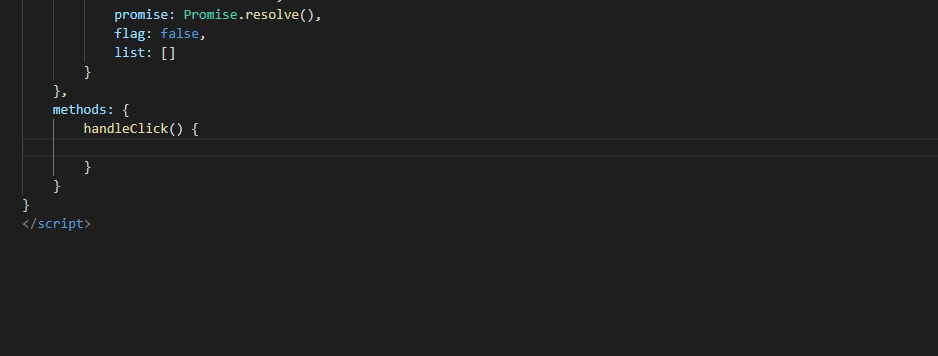


### JSDoc support

You can make a perfect documentation for your components with JSDoc syntax in comments (see example below). This documentation will be shown in completion items and on hover. You can read about all JSDoc features in [sveltedoc-parser](https://github.com/alexprey/sveltedoc-parser/blob/master/README.md) package documentation.

Basically, this extensions supports following JSDoc features:
 
- Component description
- Methods description
- Data and computed properties description
- Respect for `@private`, `@protected`, `@public` attributes to filter completion items

```html
<button role="button" on:click="handleButtonClick()" disabled={disabled}>
    {#if text}
        {text}
    {:else}
        <!-- Slot to render a custom content when @see text is not specified -->
        <slot></slot>
    {/if}
</button>

<script>
/**
 * Simple button UI element.
 */
export default {
    data() {
        return {
            /**
             * The plain text for button.
             */
            text: '',
            /**
             * Indicates that this button can't be clicked
             */
            disabled: false
        };
    },
    methods: {
        /**
         * Custom button click handler.
         * @private
         */
        handleButtonClick() {
            const { disabled } = this.get();
            if (disabled) {
                return;
            }

            /**
             * Fires when user clicks on the button.
             * @event click 
             */
            this.fire('click');
        }
    }
}
</script>
```

## TODO
- Signature help for component tags
- Workspace symbol search
- Find all references
- Rename symbol