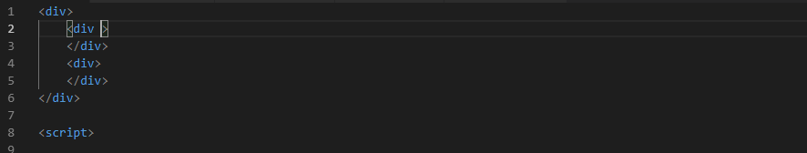

# svelte-intellisense


[](https://marketplace.visualstudio.com/items?itemName=ardenivanov.svelte-intellisense)


Provides intellisense for data, events, slots etc. in components. Utilizes [sveltedoc-parser](https://github.com/alexprey/sveltedoc-parser) for getting information about components.

## Installation

This extension provides a features for `svelte` language files. For basic support of `svelte` files you should install this extension: [VSCode Svelte](https://marketplace.visualstudio.com/items?itemName=JamesBirtles.svelte-vscode) that provides svelte syntax highlihting and syntax checks.

## Features

### Go to definition

This extension supports a go to defenition VSCode feature to quick navigation between components.
Just click to component usage in markup or symbol in import section and view source code of them.


### Hover

Component documentation provider on hover in template markup, import statement and components scope.


### Completion

1. Path resolving for `import` statement in script path

Allow to you quick search of required files to import, like a script file or svelte component. Also include search into `node_modules` folder, if exist. Files provided from `node_modules` marked with special label.


2. Path resolving for `components:` import statement


3. Standart svelte syntax completion for HTML tags
- Support autocompletion for `use:`, `transition:`, `in:`, `out:`, `bind:`, `class:`, `ref:`



4. Tag-openning completions for svelte special components and imported component


4. Component data and slots


5. Component events and expressions


6. Svelte template blocks

This extension supports all svelte blocks, like `if`, `each`, `await` with inner branching.


7. Data and computed properties provider for component state getter

The same thing are supported for writing a computed properties.


8. Data properties provider for component state setter


9. Svelte methods providers in script section

Also provide auto-completion for `this.refs.`


### JSDoc support

You can make a perfect documentation for your components with JSDoc syntax in comments (see example below). This documentation will shown into completion items and hovers. About all JSDoc features you can read in [sveltedoc-parser](https://github.com/alexprey/sveltedoc-parser/blob/master/README.md) package documentation.

Basically, in this extensions supports following JSDoc features:
 
- Component description
- Methods description
- Data and computed properties description
- Respecting of `@private`, `@protected`, `@public` attributes to filter completion items

```html
<button role="button" on:click="handleButtonClick()" disabled={disabled}>
    {#if text}
        {text}
    {:else}
        <!-- Slot to rendring a custom content when @see text is not specified -->
        <slot></slot>
    {/if}
</button>

<script>
/**
 * Simple button UI element.
 */
export default {
    data() {
        return {
            /**
             * The plain text for button.
             */
            text: '',
            /**
             * Indicates that this button can't be clicked
             */
            disabled: false
        };
    },
    methods: {
        /**
         * Custom button click handler.
         * @private
         */
        handleButtonClick() {
            const { disabled } = this.get();
            if (disabled) {
                return;
            }

            /**
             * Fires when user clicks on the button.
             * @event click 
             */
            this.fire('click');
        }
    }
}
</script>
```

## TODO

- Signature help for component tags
- Hover for data items in template and script
- Workspace symbol search
- Find all references
- Renaming